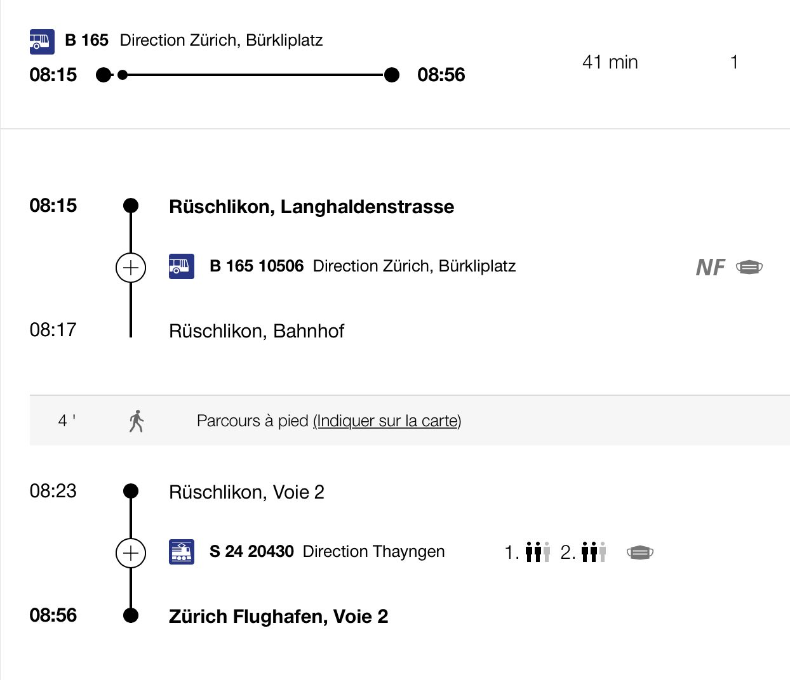
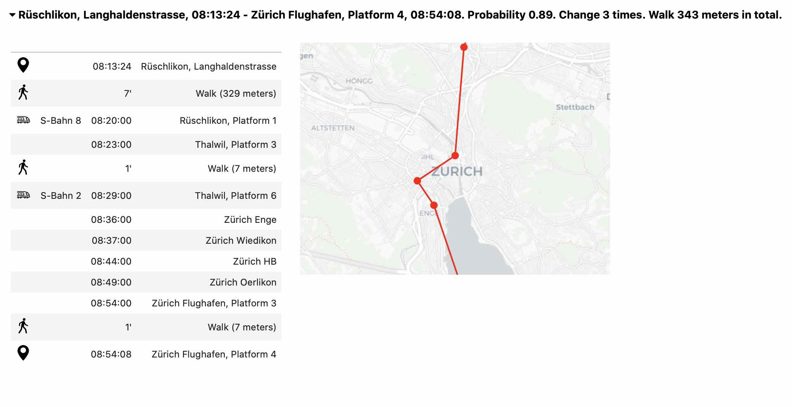
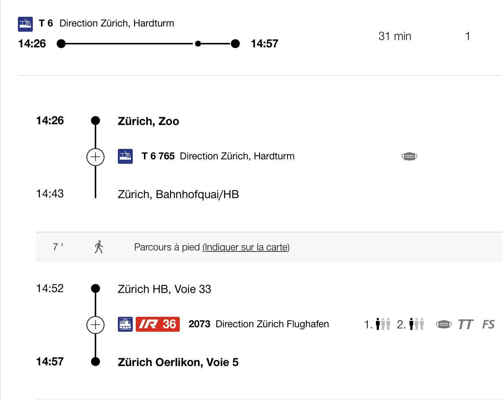
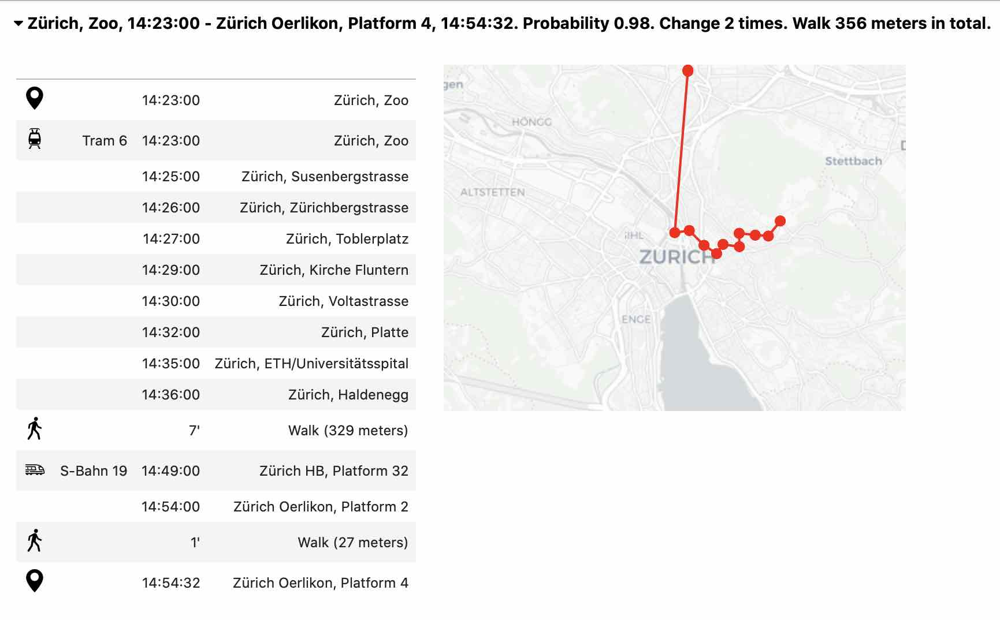
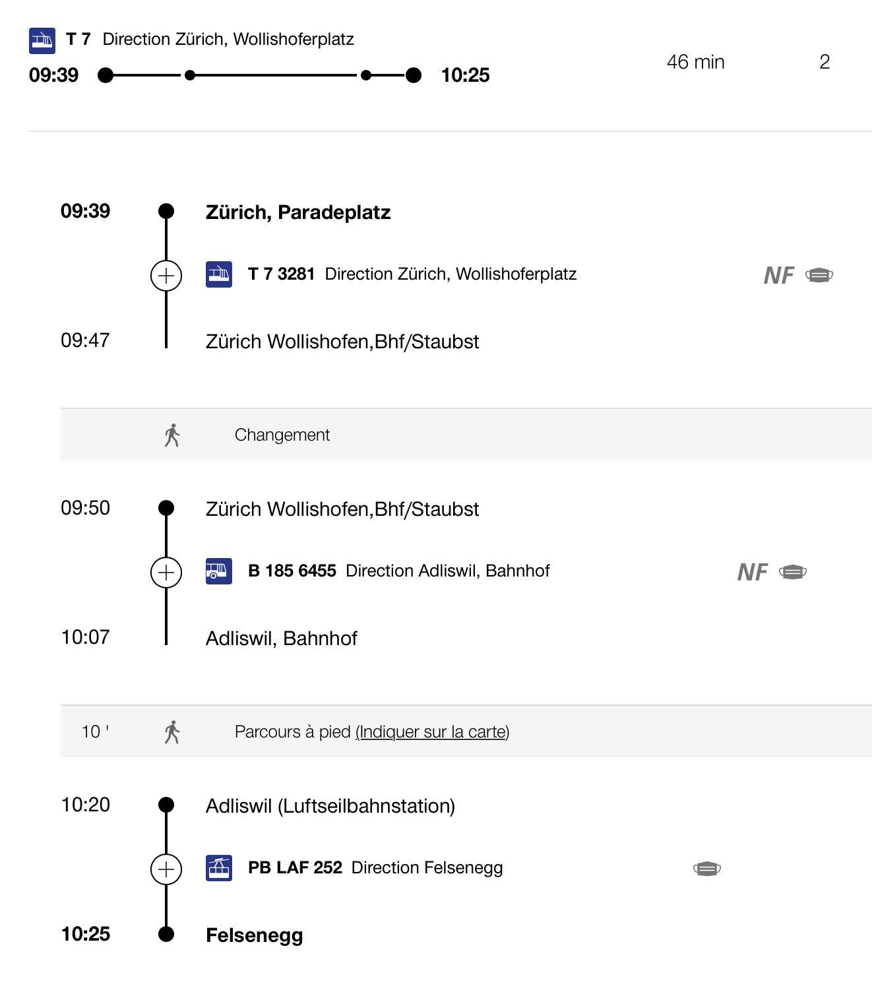
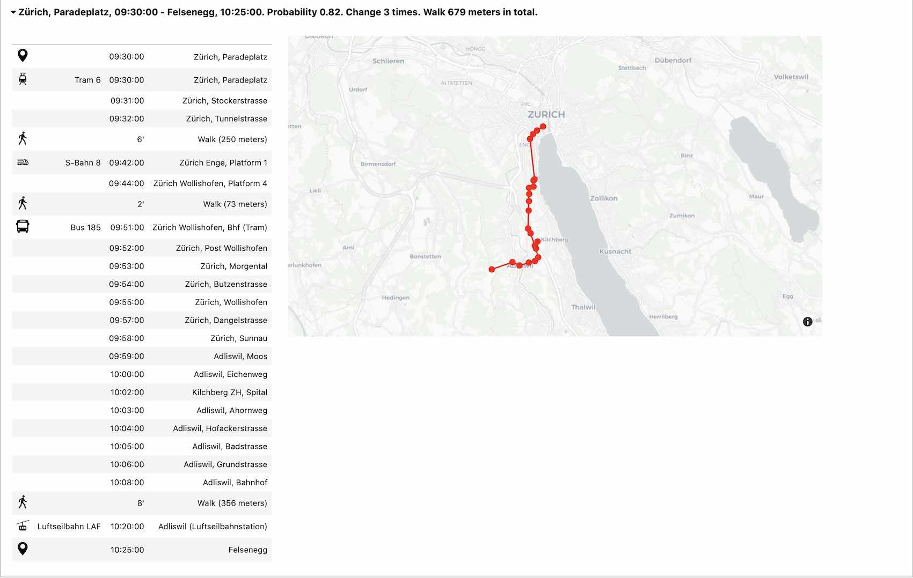

# Validating the model

To verify the performance of our journey planner, we need to compare its results to state of the art planners. More specifically, we decided to compare it to the SBB route planner. 

## Example 1

- Departure: Rüschlikon, Langhaldenstrasse
- Destination: Zürich Flughafen
- Arrival time: 09:00:00
- Probability: 75 %

### Trip comparison

  
  

### Comments
The both route planner find a journey that takes approximately 41 minutes. The SBB route planner have one change and our route planner have 2 more changes because it starts and ends with a walk. The two journey do not take the same path but they took the same time. Moreover, the probability asked was 75% but our route planner found a path with a probability of success of 89%.

## Example 2

- Departure: Zürich, Zoo
- Destination: Zürich Oerlikon 
- Arrival time: 15:00:00
- Probability: 75 %

### Trip comparison

  
  

### Comments 
The both route planner find a journey that takes approximately 31 minutes. Both journey have the same number of changes if we don't consider the last transfer of our planner journey that walks between two plateforms. We can see that they take both the tram 6 at the beginning and have a different second transport. Again, the probability asked was 75% but our route planner found a path with a probability of success of 98% this time.

## Example 3

- Departure: Zürich, Paradeplatz
- Destination: Felsenegg
- Arrival time: 10:30:00
- Probability: 75 %

### Trip comparison

  
  

### Comments
In this example, the route planner of SBB is 9 minutes faster than our route planner. One more change is made with our route planner. They take both the bus 185 and the cable car. Moreover, we can see that between the two changes they have more time of walking, they may take a slower speed. The probability of sucess asked was 75% but our algorithm found a probability of success of 82%.